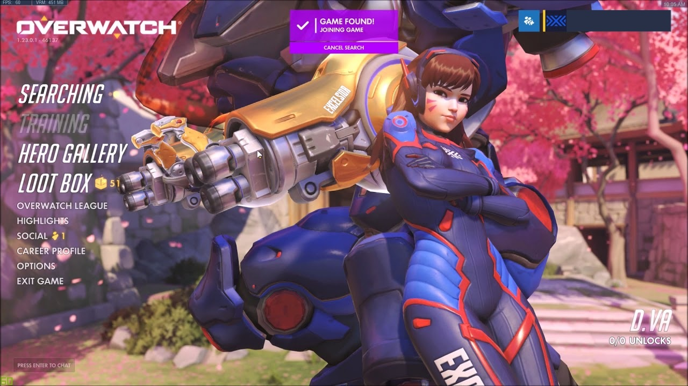

# OverwatchNotification
 A desktop application that runs in the background and sends you a text message notification when your overwatch games are found. Upon starting the program, it will constantly run in the background until you stop it or shutdown/restart your computer. It can be run during your whole gaming session without introducing lag and will send you a text notification when every game you queue for is found.  
 
  
  
 
 Python Version:  
 - 3.7  
 
 Currently supported emails:  
 - gmail  
 
 Currently supported phone carriers:  
 - att  
 - tmobile  
 - verizon  
 - sprint  
 - virgin  
 - boost  
 - cricket  
 - metro  
 - us cellular  
 - xfinity  

One time setup:  
 - add your phone number, phone carrier, email, and email password to the config.py file  
 - sign into your gmail account  
 - turn allow less secure apps to ON using the link below  
 https://myaccount.google.com/lesssecureapps?pli=1&rapt=AEjHL4NLknQ0n1ii0IaCeaXqFEZ1ros8GARoX3lNhSHDcnWE81APVGwMdVot0UQVbzPiz5XYrxtccBkVXJTXcDW0dCBphk4Svw  
 
 How to use:  
 - make sure you completed the above one time setup  
 - run main.py  
